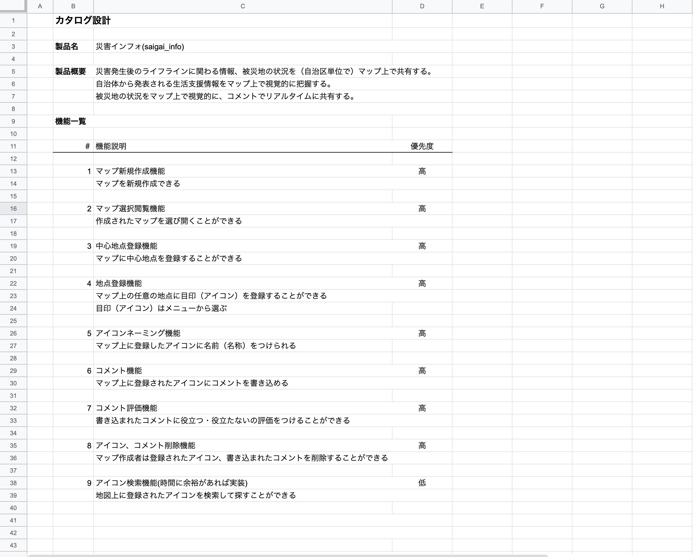
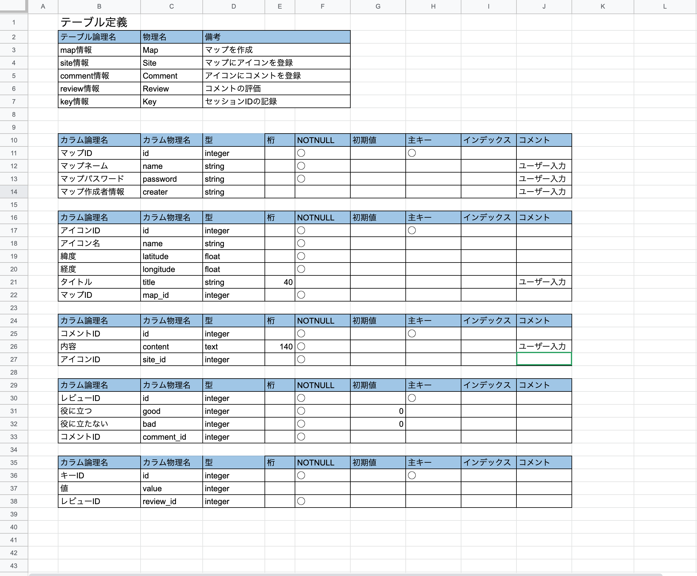
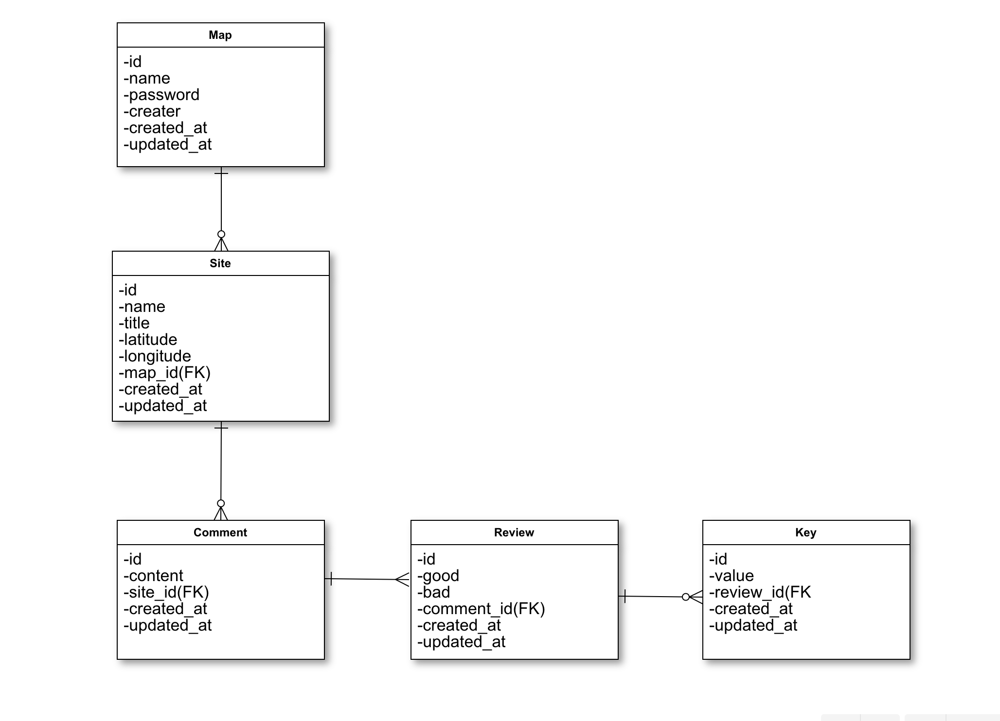
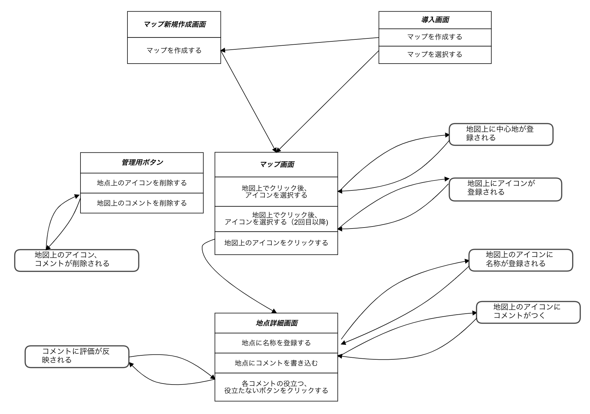
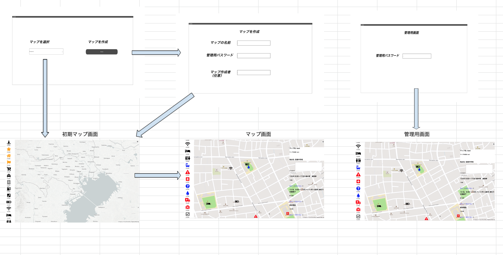

# アプリ名：saigai_info

## アプリ概要
災害発生後に自治体のライフライン支援情報や自治区の災害情報をマップ上で視覚的に把握するアプリです。  
地図上の任意の地点にアイコンを選んで登録できます。  
アイコンを登録した後は、アイコンに名称をつけコメントを加えることで最新の情報を共有できます。  
コメントにいいね機能をつけることで情報の信憑性を計ります。  
マップ作成者が主に情報を管理しますが、閲覧者も自由にアイコンを登録したり、コメントを書いたりできます。  
マップ作成者のみがアイコンの削除やコメントの編集・削除ができます。  
アプリの性質上ログイン機能はありません。  
AWS使用予定です。

## バージョン
ruby version: ruby 2.6.5  
rails version: rails 5.2.4

## 機能一覧
- マップ作成機能(Mapbox API使用)
   - マップ名、パスワード（管理用）は必須
   - マップに中心点を登録する

- アイコン作成機能
   - マップ上の任意の地点にアイコンを登録する(アイコンはメニューから選ぶ）
   - 登録したアイコンに地点の名称をつける

- コメント閲覧・作成機能(Ajax使用)
   - 登録した地点（のアイコン）をクリックしてその地点へのコメントを閲覧する
   - 登録した地点（のアイコン）に対し新たにコメントを加える

- コメント評価機能
   - 登録した地点に対してなされた各コメントが役に立つか否かボタンを押し評価する(ボタンは「役に立つ」「役に立たない」の2つ)(セッションIDが同じ場合は一つのコメントに対して2回以上ボタンが押せない)

- 管理機能
   - マップ作成者が作成時に登録したパスワードを使用して管理画面に入る。
   管理画面では、登録されたアイコンの削除、コメントの削除ができる。

## カタログ設計

## テーブル定義

## ER図

## 画面遷移図

## ワイヤーフレームワーク

## 使用予定Gem
* 'webpacker'
* 'mapbox-gl-rails'
* 'sassc-rails'
* 'font-awesome-sass'
* 'font-awesome-rails'
* 'gem 'jquery-rails'
* 'gem 'jquery-turbolinks'
