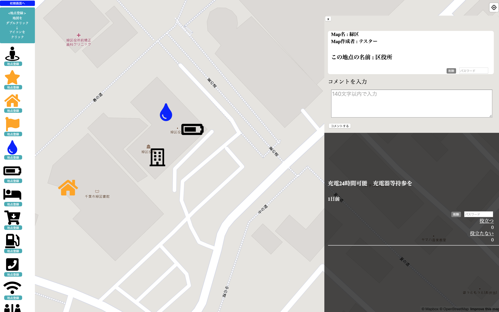
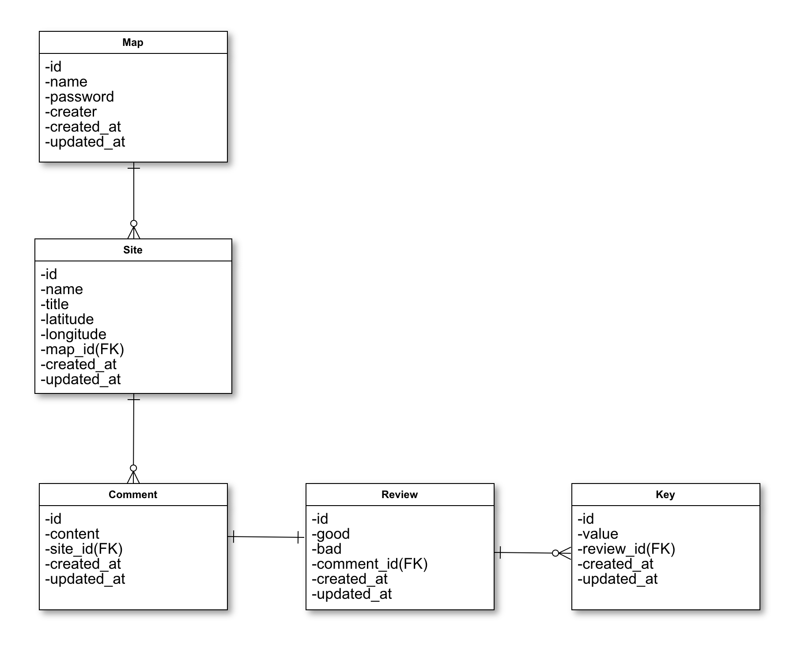

# アプリ名：saigai__info

## アプリ概要
災害発生後に自治体や企業のライフライン支援情報、災害情報等をマップ上で共有するアプリです。  
地図上の任意の地点にアイコンを選んで登録できます。  
アイコンを登録した後は、アイコンに名称をつけコメントを加えることで最新の情報を共有できます。  
コメントにいいね機能をつけることで情報の信憑性を計ります。  
マップ作成者が情報を管理しますが、閲覧者も自由にアイコンを登録したり、コメントを書くことができます。  
マップ作成者はアイコンの削除やコメントの編集・削除ができます。  

## バージョン
ruby version: ruby 2.6.5  
rails version: rails 5.2.4  

## 機能一覧
- マップ作成機能
   - マップを新規に作成する

- アイコン作成機能
   - マップ上の任意の地点にアイコンを登録する(アイコンはメニューから選ぶ）
   - 登録したアイコンに地点の名称をつける

- コメント閲覧・作成機能
   - 登録した地点（のアイコン）をクリックしてその地点へのコメントを閲覧する
   - 登録した地点（のアイコン）に対し新たにコメントを加える

- コメント評価機能
   - 登録した地点に対してなされた各コメントを"thumb upボタン"か"thumb downボタン"で評価する。
   コメントにはそれらの総数が表示される(セッションIDが同じ場合は一つのコメントに対して2回以上ボタンが押せない)

- 管理機能
   - マップ作成者は地図上に登録されたアイコンの削除、コメントの削除ができる。

## テーブル定義

## ER図

## 画面遷移図

## 画面構成

## 使用Gem
* 'webpacker'
* 'mapbox-gl-rails'
* 'sassc-rails'
* 'font-awesome-sass'
* 'gem 'jquery-rails'
* 'gem 'jquery-turbolinks'  
   etc.

## スタート
1. git clone
2. bundle install
3. yarn install
6. rails db:create rails db:migrate rails db:seed
7. .envファイル作成（MAPBOX_API_KEY記入)
8. rails s
